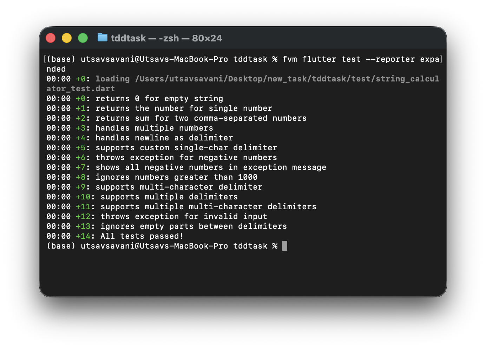

# String Calculator TDD Kata

[](https://dart.dev)
[](https://flutter.dev)
[](https://en.wikipedia.org/wiki/Test-driven_development)
[]()

A Dart implementation of the **String Calculator Kata** demonstrating strict **Test-Driven Development (TDD)** methodology. This project was built as part of the [Incubyte TDD Assessment](https://blog.incubyte.co/blog/tdd-assessment/).

## Topics

`dart` `flutter` `tdd` `test-driven-development` `kata` `string-calculator` `unit-testing` `clean-code` `incubyte`

---

## Project Overview

This project implements a String Calculator that adds numbers from a string input. The implementation follows the **Red-Green-Refactor** TDD cycle, where each feature is developed incrementally:

| Phase | Description |
|-------|-------------|
| **RED** | Write a failing test first |
| **GREEN** | Write minimal code to make the test pass |
| **REFACTOR** | Clean up the code while keeping tests green |

### Why TDD?

- **Confidence**: Every line of code is covered by tests
- **Design**: Tests drive better API design
- **Documentation**: Tests serve as living documentation
- **Maintainability**: Refactoring is safe with comprehensive test coverage

---

## Features Implemented

| # | Feature | Description | Example |
|---|---------|-------------|---------|
| 1 | Empty String | Returns `0` for empty input | `add("")` → `0` |
| 2 | Single Number | Returns the number itself | `add("1")` → `1` |
| 3 | Two Numbers | Sum of comma-separated numbers | `add("1,2")` → `3` |
| 4 | Multiple Numbers | Handles any amount of numbers | `add("1,2,3,4,5")` → `15` |
| 5 | Newline Delimiter | Supports `\n` as delimiter | `add("1\n2,3")` → `6` |
| 6 | Custom Delimiter | Supports `//[delimiter]\n` syntax | `add("//;\n1;2")` → `3` |
| 7 | Negative Numbers | Throws exception listing all negatives | `add("-1,2,-3")` → Exception |
| 8 | Ignore > 1000 | Numbers greater than 1000 ignored | `add("2,1001")` → `2` |
| 9 | Multi-char Delimiter | Supports `//[***]\n` syntax | `add("//[***]\n1***2")` → `3` |
| 10 | Multiple Delimiters | Supports `//[*][%]\n` syntax | `add("//[*][%]\n1*2%3")` → `6` |
| 11 | Input Validation | Handles empty parts gracefully | `add("1,,3")` → `4` |

---

## Screenshots

### Test Execution


---

## Usage Examples

```dart
import 'package:tddtask/string_calculator.dart';

void main() {
  final calc = StringCalculator();

  // Basic usage
  print(calc.add(''));           // 0
  print(calc.add('1'));          // 1
  print(calc.add('1,2'));        // 3
  print(calc.add('1,2,3,4,5'));  // 15

  // Newline delimiter
  print(calc.add('1\n2,3'));     // 6

  // Custom delimiter
  print(calc.add('//;\n1;2'));   // 3

  // Ignore numbers > 1000
  print(calc.add('2,1001'));     // 2

  // Multi-character delimiter
  print(calc.add('//[***]\n1***2***3'));  // 6

  // Multiple delimiters
  print(calc.add('//[*][%]\n1*2%3'));     // 6

  // Input validation - empty parts ignored
  print(calc.add('1,,3'));       // 4

  // Negative numbers throw exception
  try {
    calc.add('-1,2,-3');
  } catch (e) {
    print(e);  // Exception: negative numbers not allowed -1,-3
  }
}
```

---

## Project Structure

```
tddtask/
├── lib/
│   └── string_calculator.dart      # Main implementation (37 lines)
├── test/
│   └── string_calculator_test.dart # Unit tests (14 tests)
├── screenshots/
│   ├── test_results.png            # Test execution screenshot
│   └── commit_history.png          # Git log screenshot
├── pubspec.yaml                    # Dependencies
├── analysis_options.yaml           # Linter rules
└── README.md                       # Documentation
```

---

## Running Tests

```bash
# Run all tests
flutter test

# Run tests with verbose output
flutter test --reporter expanded

# Run with coverage
flutter test --coverage

# Run specific test file
flutter test test/string_calculator_test.dart
```

---

## Test Results

```
✓ returns 0 for empty string
✓ returns the number for single number
✓ returns sum for two comma-separated numbers
✓ handles multiple numbers
✓ handles newline as delimiter
✓ supports custom single-char delimiter
✓ throws exception for negative numbers
✓ shows all negative numbers in exception message
✓ ignores numbers greater than 1000
✓ supports multi-character delimiter
✓ supports multiple delimiters
✓ supports multiple multi-character delimiters
✓ throws exception for invalid input
✓ ignores empty parts between delimiters

All 14 tests passed!
```

---

## TDD Commit History

Each feature follows the RED-GREEN-REFACTOR pattern. View the complete commit history:

```bash
git log --oneline
```

### Sample Commits:
```
RED:      test empty string returns 0
GREEN:    implement StringCalculator with add method returning 0
REFACTOR: add documentation and explicit empty check

RED:      test single number returns itself
GREEN:    parse and return single number

RED:      test two comma-separated numbers sum
GREEN:    split by comma and sum numbers
REFACTOR: use map and fold for cleaner sum
...
```

**Total: 26 commits** demonstrating incremental TDD development.

---

## Requirements

- **Dart SDK**: ^3.10.3
- **Flutter**: 3.38.4+

---

## Getting Started

```bash
# Clone the repository
git clone https://github.com/yourusername/tddtask.git

# Navigate to project
cd tddtask

# Get dependencies
flutter pub get

# Run tests
flutter test
```

---

## Author

**Utsav Savani**

---

## License

This project is open source and available under the [MIT License](LICENSE).
